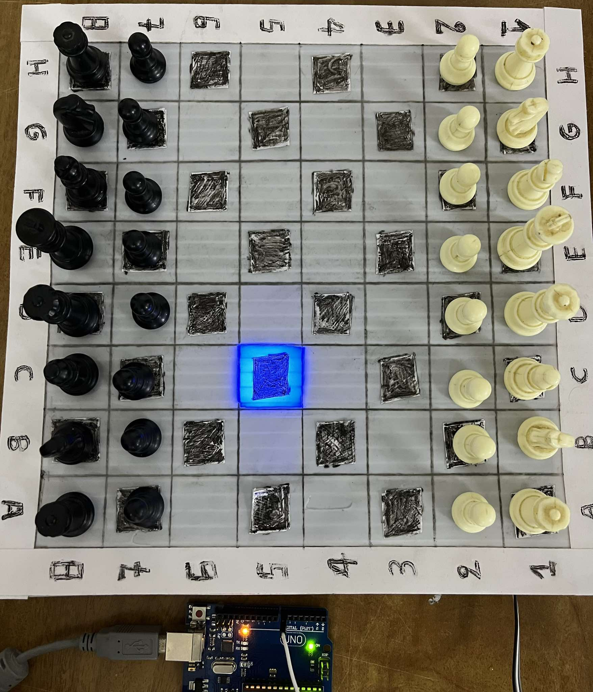
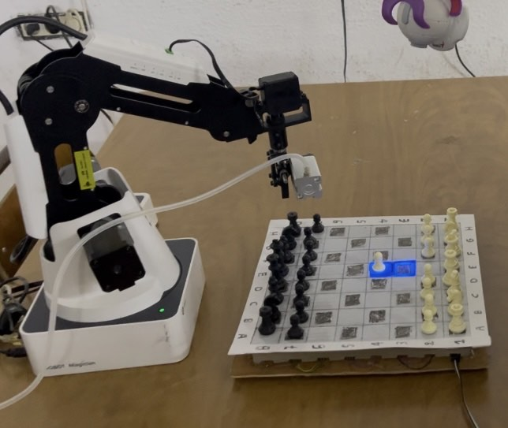

# Chess Arm Powered by LLaMA 3 70B and Stockfish



## 🚀 Overview  
This project is a **robotic chess arm** that combines cutting-edge AI technologies to provide an interactive, educational, and exciting chess-playing experience. The arm is powered by **LLaMA 3 70B** and **Stockfish**, offering features like real-time board analysis, move recommendations, and chess coaching through an intelligent assistant named **Lua**.

---

## 🛠️ Features  
- **Smart LED Chessboard**: LEDs light up on the board to highlight possible moves.  
- **AI-Powered Vision System**:  
  - A camera captures the board's state.  
  - A custom AI model converts the board image (JPG) into FEN notation for analysis.  
  - Based on the [Chess CV project](https://github.com/Rizo-R/chess-cv).  
- **Lua: The AI Chess Coach**:  
  - **Easy**: Analyzes every move for beginners.  
  - **Medium**: Highlights missed opportunities or brilliant moves.  
  - **Hard**: Provides feedback only when requested.  
  - Answers chess-related questions and explains why certain moves are good or bad.  
- **Stockfish Integration**:  
  - Leverages the power of Stockfish for move calculation and strategy evaluation.  

---

## 💡 How It Works  
1. **Board Detection**:  
   - The system captures the current state of the board using a camera.  
   - The AI model processes the image and generates FEN notation.  
2. **Move Analysis**:  
   - Lua provides move suggestions, evaluates positions, and answers questions based on the board state.  
3. **LED Feedback**:  
   - LEDs on the board indicate possible moves, making gameplay more intuitive.  
4. **Robotic Arm**:  
   - Executes moves based on AI recommendations or user input.

---

## 🤖 Technologies Used  
- **AI Models**:  
  - **LLaMA 3 70B**: For natural language processing and chess coaching.  
  - **Stockfish**: For high-level chess analysis.  
- **Computer Vision**:  
  - Camera-based board recognition using [Chess CV](https://github.com/Rizo-R/chess-cv).  
- **Hardware**:  
  - LED-integrated chessboard.  
  - Robotic arm for physical gameplay.  

---
## Requirements 🛠️

The following modules must be installed to use this project:

```bash
pip install keras
pip install -U matplotlib
pip install numpy
pip install opencv-contrib-python
pip install chess
pip install scipy
pip install tensorflow
pip install wand
pip install Groq
pip install gtts
pip install pydub
pip install whisper
pip install subprocess
pip install cv2
pip install opencv-python
```
### Additional Requirements:
- You need a **Groq API key** to access certain features of this project. Ensure you have your API key set up before proceeding.
